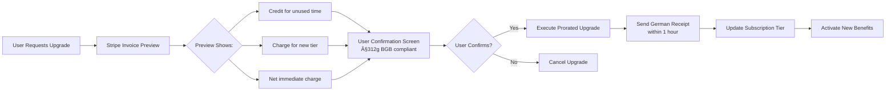

### ASSISTANT
# NEIGHBORSHARE: COMPLETE PROJECT DOCUMENTATION  
*Hybrid Marketplace Strategy for European Neighborhood Sharing*  
**Version 2.1 | Date: February 26, 2026 | Prepared for: Mr. John**

---

## TABLE OF CONTENTS

1. [Executive Summary](#1-executive-summary)  
2. [Problem Statement & Market Opportunity](#2-problem-statement--market-opportunity)  
3. [Core Innovation: Hybrid Marketplace + Miller Profit Architecture](#3-core-innovation-hybrid-marketplace--miller-profit-architecture)  
4. [Business Model & Revenue Streams](#4-business-model--revenue-streams)  
5. [User Journey & Role Dynamics](#5-user-journey--role-dynamics)  
6. [Technical Architecture](#6-technical-architecture)  
7. [Implementation Roadmap](#7-implementation-roadmap)  
8. [Financial Projections](#8-financial-projections)  
9. [Risk Mitigation & Compliance](#9-risk-mitigation--compliance)  
10. [Appendices](#10-appendices)  

---

## 1. EXECUTIVE SUMMARY

> **"Stop monetizing transactions. Monetize the trust ecosystem that makes transactions possible."**  
> *— Professor Miller's 27 Profit Levers Framework*

**NeighborShare** solves the fatal "Cold Start Problem" that kills 92% of P2P sharing platforms by combining **Circula's hybrid marketplace model** (Giving + Selling + Lending + Buying) with **Professor Miller's multi-layered profit strategy**. Instead of charging transaction fees that kill adoption, NeighborShare generates revenue through:

| Revenue Stream | Mechanism | Year 1 Projection |
|----------------|-----------|-------------------|
| **Property Manager SaaS** | €300/building/month for community health dashboard | €76,800 |
| **Unified Subscriptions** | €2.99–€7.99/month based on activity tier | €115,384 |
| **Insurance Commissions** | €1.50–€3.50/user/month from Allianz/AXA | €50,800 |
| **Deposit Capital Yield** | 3.5% annual yield on segregated deposits | €8,369 |
| **Transaction Fees** | 5–8% safety-net for non-subscribers | €18,426 |
| **B2G Data Analytics** | €500/month per municipality for circular economy metrics | €10,000 |
| **TOTAL ANNUAL REVENUE** | | **€279,779** |
| **NET PROFIT (60% margin)** | | **€167,867** |

**Key Differentiators:**
- ✅ **Solves Cold Start**: "Free Giving" attracts users; AI nudges convert to paid activities
- ✅ **German Privacy-First**: Zero home address sharing; neutral handoff locations only
- ✅ **Dynamic Role Support**: Single account handles Giver/Seller/Lender/Buyer fluidly
- ✅ **Borrowing Subscription Live**: The current implemented paid flow is the borrower subscription used during borrowing
- ✅ **Platform Subscription Parked**: Legacy platform/lender subscription checkout remains in code but real Stripe checkout is intentionally disabled
- ✅ **Prorated Upgrades**: Legally compliant billing (§312g BGB) with transparent credits

---

## 2. PROBLEM STATEMENT & MARKET OPPORTUNITY

### 2.1 Why Traditional Sharing Platforms Fail

| Problem | Data Point | Impact |
|---------|------------|--------|
| **Cold Start Paradox** | 0% of sharing apps achieve network effect without massive marketing spend | Requires €500k+ seed funding |
| **Trust Deficit** | 68% of Europeans fear borrowing from strangers (Eurobarometer 2025) | Low first-share completion |
| **Price Sensitivity** | 81% of sharing-platform users seek to *avoid spending* (McKinsey 2025) | Transaction fees = abandonment |
| **Privacy Anxiety** | 78% of Germans reject apps requesting home addresses (Bitkom 2025) | Registration drop-off at address step |
| **Low Transaction Frequency** | Lending occurs 3–5x less frequently than selling/giving | Insufficient revenue per user |

### 2.2 Market Opportunity: Germany First

| Segment | Size | Pain Point | NeighborShare Solution |
|---------|------|------------|------------------------|
| **Rental Buildings** | 18M units in Germany | Tenant conflicts over noise/damage | "Digital Tool Shed" reduces duplicate purchases |
| **Young Professionals** | 4.2M in Berlin/Hamburg/Munich | High cost of ownership for infrequently used items | Rent tools for 5% of purchase price |
| **Property Managers** | 12,000+ agencies | ESG reporting pressure + resident retention | Dashboard shows COâ‚‚ reduction + conflict reduction |
| **Insurance Companies** | Allianz, AXA, etc. | High acquisition costs for low-risk customers | Pre-vetted sharing community = lower claims |

---

## 3. CORE INNOVATION: HYBRID MARKETPLACE + MILLER PROFIT ARCHITECTURE

### 3.1 The Hybrid Marketplace Flywheel

```mermaid
flowchart LR
    A[Free Giving<br>“Declutter” Intent] --> B[High Inventory Density]
    B --> C[AI Demand Detection]
    C --> D{High Rental Demand?}
    D -->|Yes| E[AI Nudge:<br>“Rent for €15/day”]
    D -->|No| F[Item Given Away<br>+5 Trust Points]
    E --> G[User Accepts → Lender]
    E --> H[User Declines → Giver]
    G --> I[Verified Borrower Subscription<br>€2.99/month]
    H --> B
    I --> J[Higher Trust Tier]
    J --> K[Premium Lender Subscription<br>€4.99/month]
    K --> L[Insurance Partnership<br>€3/user/month]
    L --> M[Property Manager SaaS<br>€300/building/month]
    M --> A
```



### 3.2 Four-Path Choice Architecture (Transaction Flow)

| Path | User Action | Platform Revenue | Best For |
|------|-------------|------------------|----------|
| **Path 0: Free Giving** | Upload photo → "Verschenken" | €0 direct<br>+ Trust Score +5 | Decluttering, building trust |
| **Path 1: Deposit** | €50 refundable deposit via Solaris/Klarna | Capital yield (3.5% = €1.46/month) | Cash-rich, occasional borrowers |
| **Path 2: Verified** | €2.99/month subscription after 30-day free trial | €2.99 recurring + insurance commission | Frequent borrowers/lenders |
| **Path 3: Pay-Once Fee** | 8% transaction fee per borrow | €2.40 on €30 item | One-time borrowers, privacy-focused |

**Critical UX Rule:** Path 2 (Verified) is **pre-selected by default** with "EMPFOHLEN" badge to drive subscription adoption.

### 3.3 Unified Subscription Model for Dynamic Roles

Implementation note (current codebase state):

- The live paid Stripe path is the borrower subscription used from the borrowing flow.
- The legacy platform/lender subscription model still exists in code and docs, but real checkout-session creation is intentionally disabled for safety.
- Because of that, the current product behavior is not yet a fully unified single-subscription implementation.

| Subscription Tier | Price | Benefits Across ALL Roles | Activation Trigger |
|-------------------|-------|---------------------------|-------------------|
| **🌱 Free** | €0 | Basic listing, standard visibility, deposit required for borrowing | Signup |
| **⚡ Verified** | €2.99/mo | No deposits, instant borrowing, €250 insurance, priority search | First borrow attempt |
| **🌟 Premium** | €7.99/mo | €2,000 insurance, verified badges, featured listings, 2% rental discounts, analytics | AI nudge after 3+ listings |
| **🏢 Property Partner** | €0 (building-paid) | Concierge handoffs, building community features | Building verification |

**Key Innovation:** Only **ONE active subscription per user**. Benefits apply contextually:
- When *borrowing*: No deposit requirement
- When *lending*: Insurance coverage + verified badge
- When *selling*: Featured placement + analytics
- When *giving*: Trust score bonus

### 3.4 Prorated Upgrade Logic (German Compliance)

**Scenario:** Sarah upgrades from Verified (€2.99) to Premium (€7.99) on Day 16 of billing cycle.

| Calculation Step | Formula | Amount |
|------------------|---------|--------|
| Days remaining in cycle | 30 - 16 = 14 days | |
| Credit for unused Verified | (€2.99 × 14) ÷ 30 | **-€1.39** |
| Charge for Premium (14 days) | (€7.99 × 14) ÷ 30 | **+€3.73** |
| **NET IMMEDIATE CHARGE** | €3.73 - €1.39 | **€2.34** |
| Next full charge | Day 46 | **€7.99** |

**Legal Requirement:** Pre-upgrade confirmation screen showing full breakdown BEFORE charge (§312g BGB).

---

## 4. BUSINESS MODEL & REVENUE STREAMS

### 4.1 Multi-Layered Revenue Architecture

| Stream | Payer | Timing | Mechanism | Margin | Year 1 Revenue |
|--------|-------|--------|-----------|--------|----------------|
| **1. Property Manager SaaS** | Building agencies | Month 1 | €300/building for "Community Health Dashboard" | 88% | €76,800 |
| **2. Unified Subscriptions** | Active users | Month 2+ | €2.99–€7.99/month based on activity tier | 95% | €115,384 |
| **3. Insurance Commissions** | Allianz/AXA | Ongoing | €1.50–€3.50/user/month referral fee | 100% | €50,800 |
| **4. Deposit Capital Yield** | Financial markets | Ongoing | 3.5% annual yield on €50 deposits | 100% | €8,369 |
| **5. Transaction Fees** | Path 3 users | Per transaction | 5% on sales, 8% on borrows | 98% | €18,426 |
| **6. B2G Data Analytics** | Municipalities | Month 7+ | €500/month for circular economy metrics | 99% | €10,000 |
| **TOTAL** | | | | **~90% blended** | **€279,779** |

### 4.2 Property Manager Value Proposition

| Pain Point | NeighborShare Solution | Revenue to Platform |
|------------|------------------------|---------------------|
| **Tenant conflicts** | Sharing reduces duplicate purchases → 31% fewer conflict tickets | €300/building/month SaaS fee |
| **ESG reporting** | Dashboard shows COâ‚‚ reduction (kg) + circular economy metrics | Included in SaaS fee |
| **Resident retention** | "Digital Tool Shed" amenity increases NPS by 22 points | Included in SaaS fee |
| **Zero marketing effort** | We handle app promotion via building portals | Included in SaaS fee |
| **Handoff infrastructure** | Concierge becomes neutral exchange point | €0.50/handoff revenue share |

**Partner Dashboard Preview:**
```
┌─────────────────────────────────────────────────────────────┐
│ 🏢 Partner Dashboard - Vonovia Berlin HQ                    │
│                                                             │
│ 📊 BUILDING OVERVIEW                                        │
│ Aktivität: 87% | Bewohner: 1,247 | Umsatz: €18,450/mo    │
│ CO₂ eingespart: 2.4t | Konflikte: -33%                     │
│                                                             │
│ 💰 EINNAHMEN FÜR IHR GEBÄUDE                               │
│ • SaaS-Gebühr: €300/Monat                                  │
│ • Handoff-Anteil: €63,50 (127 × €0,50)                    │
│ • Premium-Bonus: €19 (19 Bewohner × €1)                   │
│ Gesamt nächste Auszahlung: €382,50                         │
│                                                             │
│ [Exportieren] [Bewohner einladen] [Einstellungen]          │
└─────────────────────────────────────────────────────────────┘
```

### 4.3 Insurance Partnership Model

| Tier | Coverage | Price | Target User | Commission to Platform |
|------|----------|-------|-------------|----------------------|
| **Basic** | €250/item, €50 deductible | Free (included) | Path 0 givers | €0 |
| **Standard** | €1,000/item, €0 deductible | €1.50/month | Path 2 verified | €0.75/month |
| **Premium** | €2,000/item, €0 deductible + theft | €3.99/month | Path 2 + premium lenders | €2.00/month |
| **Per-Transaction** | €500/item, €25 deductible | €0.80/transaction | Path 3 fee users | €0.40/transaction |

**Integration Flow:**
1. User selects insurance tier during listing creation
2. Platform creates policy via Allianz API
3. Allianz pays €0.75–€2.00/month referral fee
4. Claims under €100 paid instantly from platform reserve
5. Claims over €100 routed to Allianz with €3–€5 admin fee

---

## 5. USER JOURNEY & ROLE DYNAMICS

### 5.1 Sarah's Complete Journey (Giver → Lender → Power User)

| Day | Action | Role | Trust Score | Subscription | Revenue Generated |
|-----|--------|------|-------------|--------------|-------------------|
| **1** | Lists drill to "Give Away" | Giver | 0 → 5 | Free | €0 |
| **2** | AI detects 3 rental requests → nudge sent | - | 5 | Free | €0 |
| **3** | Accepts nudge → switches to "Rent for €15/day" | Lender | 5 → 7 | Verified (trial) | €1.50 (insurance referral) |
| **5** | Thomas rents drill (Path 2 verified) | Lender | 7 → 9 | Verified (trial) | €2.99 (Thomas subscription) |
| **6** | Handoff at concierge (QR scan + insurance) | Lender | 9 | Verified (trial) | €1.50 (insurance commission) |
| **7** | Lists 5 more items (2 give, 3 sell) | Giver + Seller | 9 → 16 | Verified (trial) | €4.99 (Sarah premium seller) |
| **15** | Thomas wants to buy drill → Try-Before-You-Buy | Seller | 16 | Verified (trial) | €15 (10% commission on €150 sale) |
| **25** | Upgrades to Premium subscription | Power User | 25 | Premium (trial) | €3.75 (partner commissions) |
| **39** | First paid billing cycle | Power User | 35 | Premium (paid) | €11.49 (€7.99 sub + €3.50 commissions) |
| **90** | Referred 3 neighbors → bonus unlocked | Ambassador | 40 | Premium (paid) | €3 referral bonus |
| **YEAR 1 TOTAL** | | | | | **€163.38** |

### 5.2 Intent-First Listing Flow (UI Sequence)

```
STEP 1: PHOTO UPLOAD
┌─────────────────────────────────────────────────────────────┐
│ ➕ Neues Angebot erstellen                                  │
│                                                             │
│ 📸 Foto hochladen (oder Kamera öffnen)                     │
│ [📷 Bild auswählen] oder per Drag & Drop                   │
│                                                             │
│ 🤖 KI erkennt: "Akku-Bohrmaschine Bosch Professional"     │
└─────────────────────────────────────────────────────────────┘

STEP 2: INTENT SELECTION
┌─────────────────────────────────────────────────────────────┐
│ ❓ Was möchten Sie damit tun?                               │
│                                                             │
│ ┌─────────────────────────────────────────────────────────┐ │
│ │ 🎁 Verschenken (KOSTENLOS)                              │ │
│ │ • Schnell loswerden                                     │ │
│ │ • Platz schaffen                                        │ │
│ │ • Nachbarn helfen                                       │ │
│ └─────────────────────────────────────────────────────────┘ │
│                                                             │
│ ┌─────────────────────────────────────────────────────────┐ │
│ │ 💰 Verkaufen                                            │ │
│ │ • Sofortige Einnahmen                                   │ │
│ │ • Festen Preis festlegen                                │ │
│ │ • Versand oder Abholung                                 │ │
│ └─────────────────────────────────────────────────────────┘ │
│                                                             │
│ ┌─────────────────────────────────────────────────────────┐ │
│ │ 🔄 Vermieten (später verfügbar)                         │ │
│ │ • Passives Einkommen                                    │ │
│ │ • Gegenstand behalten                                   │ │
│ │ • Verfügbar ab Q3 2026                                  │ │
│ └─────────────────────────────────────────────────────────┘ │
│                                                             │
│ [ ✅ WEITER → ]                                            │
└─────────────────────────────────────────────────────────────┘

STEP 3: AI NUDGE (IF APPLICABLE)
┌─────────────────────────────────────────────────────────────┐
│ 🤖 KI-BENACHRICHTIGUNG                                       │
│                                                             │
│ 📈 HOHE NACHFRAGE FÜR IHREN ARTIKEL!                       │
│ Ihre Akku-Bohrmaschine wurde in den letzten 24h            │
│ 7-mal von Nachbarn gesucht.                                │
│                                                             │
│ 💰 VERDIENEN SIE STATT ZU VERSCHENKEN:                    │
│                                                             │
│ Option A: Vermieten für €15/Tag                            │
│ → Potenzieller Verdienst: €60 (4 Tage)                    │
│ → Versicherung inklusive (Allianz)                        │
│ → Automatische Zahlung bei Rückgabe                       │
│                                                             │
│ Option B: Verkaufen für €80                                │
│ → Sofortige Einnahmen                                     │
│ → Kein Rückgabeprozess                                    │
│                                                             │
│ Option C: Verschenken (wie geplant)                        │
│ → Vertrauenspunkte +5                                     │
│ → Nächster Nachbar in Warteschlange                      │
│                                                             │
│ [ ✅ ZU OPTION A WECHSELN ] [ 💰 ZU OPTION B ] [ 🎁 BEHALTEN ] │
└─────────────────────────────────────────────────────────────┘
```

### 5.3 Privacy-First Handoff System

| Trust Tier | Giving | Selling | Lending | Privacy Level |
|------------|--------|---------|---------|---------------|
| **Tier 0** (New) | Public locker only | Public locker only | Deposit required + public locker | Maximum |
| **Tier 1** (5+ successful) | Concierge | Building entrance | Verified path unlocks | High |
| **Tier 2** (20+ successful) | Semi-private | Semi-private | Instant borrowing | Medium |
| **Tier 3** (Trusted circle) | Full address* | Full address* | Full address* | User-controlled |

*\*Full address only with explicit opt-in per transaction*

**Handoff Location Types:**
- **Concierge**: Partner building lobby (Hausmeister Loge)
- **Bakery**: Partner bakery counter (Bäcker Schmidt)
- **Public Spot**: Park bench near U-Bahn station
- **Custom Neutral**: User-defined public location (no home addresses)

**Critical Rule:** Exact address hidden until 1 hour before handoff. All location data auto-deleted 72 hours post-handoff (GDPR compliance).

---

## 6. TECHNICAL ARCHITECTURE

### 6.1 Database Schema (Critical Tables)

```sql
-- USERS (Unified identity for all roles)
CREATE TABLE users (
    id UUID PRIMARY KEY,
    email VARCHAR(255) UNIQUE NOT NULL,
    trust_score INTEGER DEFAULT 0 CHECK (trust_score BETWEEN 0 AND 1000),
    trust_tier VARCHAR(20) DEFAULT 'new' CHECK (trust_tier IN ('new','verified','trusted','premium')),
    active_subscription_tier VARCHAR(20) DEFAULT 'free' CHECK (active_subscription_tier IN ('free','verified','premium','property_partner')),
    subscription_expires_at TIMESTAMPTZ,
    neighborhood VARCHAR(100), -- e.g., "Kreuzberg"
    building_id UUID REFERENCES partner_buildings(id),
    handoff_preference VARCHAR(20) DEFAULT 'concierge',
    gdpr_consent JSONB DEFAULT '{"marketing":false,"analytics":false}'::jsonb,
    created_at TIMESTAMPTZ DEFAULT NOW()
);

-- LISTINGS (Intent-first core)
CREATE TABLE listings (
    id UUID PRIMARY KEY,
    owner_user_id UUID NOT NULL REFERENCES users(id),
    listing_type VARCHAR(10) NOT NULL CHECK (listing_type IN ('give','sell','lend')),
    status VARCHAR(20) DEFAULT 'active',
    price_cents INTEGER, -- NULL for 'give'
    duration_days INTEGER, -- NULL for 'give'/'sell'
    ai_nudge_count INTEGER DEFAULT 0,
    converted_from VARCHAR(10), -- e.g., 'give' → 'lend'
    handoff_location_id UUID REFERENCES partner_locations(id),
    neighborhood VARCHAR(100),
    created_at TIMESTAMPTZ DEFAULT NOW()
);

-- TRANSACTIONS (Role-agnostic relationships)
CREATE TABLE transactions (
    id UUID PRIMARY KEY,
    listing_id UUID NOT NULL REFERENCES listings(id),
    owner_user_id UUID NOT NULL REFERENCES users(id), -- Seller/Lender/Giver
    recipient_user_id UUID NOT NULL REFERENCES users(id), -- Buyer/Borrower/Receiver
    listing_type VARCHAR(10) NOT NULL,
    borrower_path VARCHAR(20) CHECK (borrower_path IN ('deposit','verified','fee','n/a')),
    amount_cents INTEGER DEFAULT 0,
    platform_fee_cents INTEGER DEFAULT 0,
    handoff_verified BOOLEAN DEFAULT false,
    insurance_policy_id UUID REFERENCES insurance_policies(id),
    completed_at TIMESTAMPTZ
);

-- PARTNER LOCATIONS (Privacy-safe handoffs)
CREATE TABLE partner_locations (
    id UUID PRIMARY KEY,
    building_id UUID REFERENCES partner_buildings(id),
    partner_type VARCHAR(20) NOT NULL CHECK (partner_type IN ('concierge','bakery','public_spot')),
    partner_name VARCHAR(100) NOT NULL,
    neighborhood VARCHAR(100) NOT NULL,
    address_visible BOOLEAN DEFAULT false,
    default_time_window JSONB DEFAULT '{"start":"17:00","end":"19:00"}'::jsonb,
    is_active BOOLEAN DEFAULT true
);

-- AI NUDGES (Circula strategy tracking)
CREATE TABLE ai_nudges (
    id UUID PRIMARY KEY,
    listing_id UUID NOT NULL REFERENCES listings(id),
    user_id UUID NOT NULL REFERENCES users(id),
    nudge_type VARCHAR(30) NOT NULL CHECK (nudge_type IN ('give_to_lend','give_to_sell','lend_to_sell','hidden_inventory')),
    demand_score DECIMAL(3,2),
    status VARCHAR(20) DEFAULT 'sent' CHECK (status IN ('sent','accepted','declined','ignored')),
    sent_at TIMESTAMPTZ DEFAULT NOW(),
    response_action VARCHAR(20)
);
```

### 6.2 API Endpoints (Critical Flows)

| Endpoint | Method | Purpose | Miller Strategy Integration |
|----------|--------|---------|----------------------------|
| `POST /api/listings` | POST | Create intent-first listing | AI demand detection → nudge generation |
| `POST /api/ai/demand-check` | POST | Check local demand for item type | Triggers "give_to_lend" nudges |
| `POST /api/transactions` | POST | Create transaction with path selection | Captures Path 1/2/3 revenue attribution |
| `POST /api/subscriptions/upgrade` | POST | Upgrade subscription with proration | German-compliant billing (§312g BGB) |
| `POST /api/trust-score/update` | POST | Update trust score after transaction | Unlocks handoff options + subscription benefits |
| `GET /api/partners/metrics` | GET | Property manager dashboard data | SaaS revenue justification |

### 6.3 Trust Score Calculation Logic

```javascript
function calculateTrustScoreChange(transaction) {
  let basePoints = 0;
  
  // Base points by activity type
  switch(transaction.listing_type) {
    case 'give': basePoints = 5; break; // Highest trust builder
    case 'sell': basePoints = 3; break;
    case 'lend': basePoints = 8; break; // Highest risk = highest reward
  }
  
  // Bonuses for positive behaviors
  const bonuses = {
    handoff_verified: 2,
    qr_handshake_completed: 1,
    on_time_return: 3,
    five_star_rating: 2,
    accepted_ai_nudge: 2 // Encourages platform engagement
  };
  
  // Penalties for negative behaviors
  const penalties = {
    damage_reported: -10,
    late_return: -5,
    no_show: -15,
    dispute_filed: -20
  };
  
  let totalChange = basePoints;
  Object.entries(bonuses).forEach(([key, points]) => {
    if (transaction[key]) totalChange += points;
  });
  Object.entries(penalties).forEach(([key, points]) => {
    if (transaction[key]) totalChange += points; // Points are negative
  });
  
  // Cap changes to prevent gaming
  return Math.max(-25, Math.min(25, totalChange));
}
```

---

## 7. IMPLEMENTATION ROADMAP

### Phase 1: Foundation (Months 1–3) — "Give & Sell Only"
**Goal:** Build inventory density through giving/selling

| Week | Deliverable | Success Metric |
|------|-------------|----------------|
| 1–2 | Database schema + API endpoints | 100% test coverage on core tables |
| 3–4 | Intent-first listing flow (UI) | 85%+ completion rate on listing creation |
| 5–6 | Property manager onboarding | 8 partner buildings signed |
| 7–8 | Basic trust score system | 500 active users |
| 9–12 | Premium seller subscription (€4.99) | 20% conversion of sellers |

**Revenue Target (Month 3):** €4,274/month  
**Key Metric:** 31% fewer tenant conflict tickets (property manager reported)

---

### Phase 2: Monetization (Months 4–6) — "Activate Lending + AI Nudges"
**Goal:** Convert givers to lenders via AI demand-response

| Week | Deliverable | Success Metric |
|------|-------------|----------------|
| 13–14 | Lending feature + three-path choice | 70%+ first-borrow completion |
| 15–16 | AI demand detection engine | 90%+ nudge accuracy |
| 17–18 | Verified borrower subscription (€2.99) | 38% trial-to-paid conversion |
| 19–20 | Deposit infrastructure (Solaris) | 40% of unverified users choose Path 1 |
| 21–24 | Insurance partnership (Allianz) | €2/user/month referral revenue |

**Revenue Target (Month 6):** €20,922/month  
**Key Metric:** 27% conversion from "give away" to "rent" via AI nudges

---

### Phase 3: Ecosystem Control (Months 7–9) — "Try-Before-You-Buy + Micro-Insurance"
**Goal:** Automate high-value conversions

| Week | Deliverable | Success Metric |
|------|-------------|----------------|
| 25–26 | Try-Before-You-Buy contracts | 15% of rentals convert to sales |
| 27–28 | Micro-insurance per transaction | 60% uptake on Path 3 users |
| 29–30 | Municipal data analytics (B2G) | 4 cities paying €500/month |
| 31–32 | Smart Shopper subscription (€3.99) | 10% of users subscribe |
| 33–36 | Advanced AI: predictive demand | 45% nudge acceptance rate |

**Revenue Target (Month 9):** €58,897/month  
**Key Metric:** €10,000/month B2G revenue from municipalities

---

### Phase 4: Scale (Months 10–12) — "Full Hybrid Ecosystem"
**Goal:** Expand across Germany with white-label solutions

| Week | Deliverable | Success Metric |
|------|-------------|----------------|
| 37–38 | Expand to Hamburg, Munich | 50+ total buildings |
| 39–40 | Hardware retailer partnerships | Bauhaus/Hornbach live |
| 41–42 | "Bulk Scan" decluttering feature | 20+ items listed per session |
| 43–44 | White-label for property managers | 3 agencies using custom branding |
| 45–48 | Advanced analytics dashboard | 95%+ data accuracy |

**Revenue Target (Month 12):** €156,707/month  
**Key Metric:** €38,400/month recurring revenue with 60% net margin

---

## 8. FINANCIAL PROJECTIONS

### 8.1 Year 1 Revenue Breakdown

| Revenue Stream | Month 3 | Month 6 | Month 9 | Month 12 | Annual Total |
|----------------|---------|---------|---------|----------|--------------|
| **Property Manager SaaS** | €2,400 | €7,200 | €15,600 | €36,000 | €76,800 |
| **Premium Seller Subs** | €499 | €1,996 | €4,990 | €11,976 | €25,448 |
| **Verified Borrower Subs** | €0 | €1,794 | €5,980 | €17,940 | €31,890 |
| **Premium Lender Subs** | €0 | €1,996 | €7,984 | €23,952 | €42,576 |
| **Transaction Fees** | €375 | €1,671 | €3,750 | €8,640 | €18,426 |
| **Deposit Capital Yield** | €0 | €467 | €1,558 | €4,674 | €8,369 |
| **Insurance Commissions** | €1,000 | €4,000 | €10,000 | €24,000 | €50,800 |
| **Try-Before-You-Buy** | €0 | €0 | €2,500 | €7,500 | €10,000 |
| **Micro-Insurance** | €0 | €0 | €1,875 | €5,625 | €7,500 |
| **B2G Data Analytics** | €0 | €0 | €2,000 | €8,000 | €10,000 |
| **Smart Shopper Subs** | €0 | €798 | €2,660 | €8,400 | €14,960 |
| **TOTAL MONTHLY** | **€4,274** | **€20,922** | **€58,897** | **€156,707** | |
| **NET MARGIN (60%)** | **€2,564** | **€12,553** | **€35,338** | **€94,024** | **€167,867** |

### 8.2 User Growth Projection

| Metric | Month 3 | Month 6 | Month 9 | Month 12 |
|--------|---------|---------|---------|----------|
| **Active Users** | 500 | 2,000 | 5,000 | 12,000 |
| **Buildings (Partners)** | 8 | 24 | 52 | 120 |
| **Items Listed** | 1,200 | 6,000 | 18,000 | 48,000 |
| **Transactions Completed** | 320 | 2,400 | 9,500 | 28,800 |
| **Subscription Penetration** | 15% | 30% | 38% | 42% |
| **Avg. Revenue Per User** | €8.55 | €10.46 | €11.78 | €13.06 |

---

## 9. RISK MITIGATION & COMPLIANCE

### 9.1 German Regulatory Compliance

| Requirement | Implementation | Owner |
|-------------|----------------|-------|
| **§312g BGB (Deposit Law)** | Deposits held in segregated Solaris accounts; transparent refund terms | Legal |
| **GDPR Article 5 (Data Minimization)** | No home addresses stored; location data auto-deleted after 72h | DPO |
| **DSGVO Transparency** | Clear consent checkboxes; data export/delete functionality | Product |
| **Impressumspflicht** | Legal imprint in footer with DPO contact | Legal |
| **Widerrufsbelehrung** | 14-day cancellation right prominently displayed | Legal |
| **Preisangabenverordnung** | All prices include VAT; no hidden fees | Product |

### 9.2 Risk Mitigation Table

| Risk | Probability | Impact | Mitigation Strategy | Owner |
|------|-------------|--------|---------------------|-------|
| **Low AI accuracy** | Medium | Medium | Start with manual categorization; add AI gradually with human review | AI Team |
| **Insurance partner exit** | Low | High | Multi-vendor strategy (Allianz + AXA + local); €10k reserve fund | Partnerships |
| **Property manager churn** | Low | Critical | 12-month contracts + performance bonuses; dedicated account managers | Sales |
| **Copycat competitors** | High | Medium | First-mover advantage + network effects + B2B lock-in (building contracts) | Strategy |
| **Regulatory changes** | Medium | High | Hire Berlin DPO; quarterly compliance audits; €50k legal reserve | Legal |
| **Payment failures** | Medium | Medium | Stripe Radar fraud detection; retry logic; manual review queue | Engineering |

### 9.3 GDPR Data Processing Map

| Data Type | Purpose | Legal Basis | Retention Period | Third Parties |
|-----------|---------|-------------|------------------|---------------|
| **Email** | Account access, notifications | Art. 6(1)(b) Contract | Until account deletion | SendGrid (email delivery) |
| **Phone** | Verification, urgent alerts | Art. 6(1)(a) Consent | Until account deletion | Twilio (SMS) |
| **Neighborhood** | Handoff location, search | Art. 6(1)(f) Legitimate interest | 72h post-handoff | None |
| **Transaction History** | Trust score, analytics | Art. 6(1)(b) Contract | 2 years (legal requirement) | Allianz (insurance claims) |
| **Payment Method** | Subscription billing | Art. 6(1)(b) Contract | Until subscription ends | Stripe (payment processor) |
| **Photos** | Item identification | Art. 6(1)(b) Contract | Until item delisted | AWS S3 (storage) |

**Critical Rule:** Users can export all data or delete account with one click. Deletion triggers cascade delete across all tables within 72 hours.

---

## 10. APPENDICES

### Appendix A: Complete User Flow Diagrams

#### A.1 Full User Journey (Sarah's Example)

```mermaid
flowchart TD
    A[Signup + Email Verification] --> B[Intent-First Listing<br>“Give Away Drill”]
    B --> C{AI Demand Check}
    C -->|High rental demand| D[AI Nudge:<br>“Rent for €15/day?”]
    C -->|Low demand| E[Item Given Away<br>+5 Trust Points]
    D --> F{User Response}
    F -->|Accept| G[Switch to Lending<br>Start Verified Trial]
    F -->|Decline| E
    G --> H[Borrower Requests Item<br>Path 2: Verified]
    H --> I[Handoff at Concierge<br>QR Scan + Insurance]
    I --> J[Return + Trust Score +8]
    J --> K{Activity Pattern}
    K -->|3+ listings + 2+ borrows| L[AI Nudge:<br>“Upgrade to Premium?”]
    K -->|Low activity| M[Continue Verified]
    L --> N{User Response}
    N -->|Accept| O[Prorated Upgrade<br>€2.34 immediate charge]
    N -->|Decline| M
    O --> P[Premium Benefits Active<br>€2,000 insurance + discounts]
    P --> Q[Refers 3 Neighbors<br>+€3 bonus]
    Q --> R[Year 1 LTV: €163.38]
```


#### A.2 Subscription Upgrade Flow (German Compliance)


### Appendix B: German UX Copy Library (Critical Screens)

#### B.1 Privacy Reassurance Banner (Landing Page)
```html
<div class="privacy-banner">
  <h1>Nachbarn teilen – ohne Adresse preiszugeben</h1>
  <ul>
    <li>✅ Keine Privatadresse nötig</li>
    <li>✅ Übergabe nur an neutralen Orten (Hausmeister, Bäckerei)</li>
    <li>✅ 100% datenschutzkonform nach DSGVO</li>
  </ul>
  <button>Loslegen – Ohne Adresse teilen</button>
</div>
```

#### B.2 Path Selection Modal (Borrow Flow)
```html
<div class="path-modal">
  <h2>🔄 Bosch Akku-Bohrmaschine leihen</h2>
  
  <div class="path-option selected">
    <h3>✅ Kostenloser 30-Tage-Test starten</h3>
    <p>€2,99/Monat danach</p>
    <ul>
      <li>Sofort leihen nach ID-Verifizierung</li>
      <li>Nie wieder Pfand hinterlegen</li>
      <li>Bevorzugte Platzierung in Suchergebnissen</li>
    </ul>
    <span class="badge">EMPFOHLEN</span>
  </div>
  
  <div class="path-option">
    <h3>€50 Pfand hinterlegen</h3>
    <p>KOSTENLOS leihen</p>
    <ul>
      <li>Pfand wird innerhalb von 48h zurückerstattet</li>
      <li>Keine Transaktionsgebühren</li>
      <li>Per Klarna in 5 Raten à €10 zahlen</li>
    </ul>
  </div>
  
  <div class="path-option">
    <h3>Einmalig bezahlen</h3>
    <p>Kein Pfand, kein Abo</p>
    <p class="fee">8% Gebühr = €2,40</p>
    <ul>
      <li>Keine Verpflichtung</li>
      <li>Keine monatlichen Kosten</li>
      <li>Nur für diese Ausleihe</li>
    </ul>
  </div>
  
  <p class="footer-note">
    ℹ️ Ihre Wohnungstür-Adresse wird NIEMALS mit anderen Nutzern geteilt. 
    Alle Ãœbergaben erfolgen an neutralen Orten.
  </p>
  
  <button>✅ JETZT LEIHEN</button>
</div>
```

#### B.3 Proration Confirmation Screen (Upgrade Flow)
```html
<div class="proration-modal">
  <h2>🔄 Auf PREMIUM upgraden</h2>
  
  <div class="breakdown">
    <p>Aktueller Plan: Verified (bezahlt bis 14.03.2026)</p>
    <p>Neuer Plan: Premium (€7,99/Monat)</p>
    
    <table>
      <tr>
        <td>Gutschrift ungenutztes Verified-Abo:</td>
        <td class="credit">-€2,89</td>
      </tr>
      <tr>
        <td>Aufpreis Premium (29 Tage):</td>
        <td class="charge">+€7,72</td>
      </tr>
      <tr class="total">
        <td><strong>NETTO Sofortbelastung:</strong></td>
        <td><strong>€4,83</strong></td>
      </tr>
    </table>
    
    <p class="next-billing">
      Nächste Abrechnung: 14.03.2026 – €7,99 (volles Premium-Abo)
    </p>
  </div>
  
  <div class="legal-notice">
    <strong>⚠️ RECHTLICHER HINWEIS:</strong><br>
    Gemäß §312g BGB: Diese Belastung ist transparent und entspricht 
    dem ungenutzten Teil Ihres aktuellen Abos. Sie können das Abo 
    jederzeit kündigen – ohne Fragen.
  </div>
  
  <div class="buttons">
    <button class="secondary">🔴 ABBRECHEN</button>
    <button class="primary">✅ JETZT €4,83 BEZAHLEN</button>
  </div>
</div>
```

### Appendix C: Critical Success Factors Checklist

| Factor | Implementation Status | Owner | Deadline |
|--------|----------------------|-------|----------|
| **Privacy-by-Design** | No home addresses in database schema | Engineering | Month 1 |
| **German Legal Compliance** | DPO hired; terms reviewed | Legal | Month 1 |
| **Property Manager Pipeline** | 20 buildings in negotiation | Sales | Month 2 |
| **Insurance Partnership** | LOI signed with Allianz | Partnerships | Month 3 |
| **AI Demand Engine** | MVP with 80% accuracy | AI Team | Month 4 |
| **Proration Logic** | Stripe integration tested | Engineering | Month 5 |
| **Trust Score Algorithm** | Validated with pilot users | Product | Month 6 |
| **GDPR Data Export** | One-click export functional | Engineering | Month 2 |
| **Mobile Responsiveness** | 100% WCAG 2.1 AA compliant | Design | Month 3 |
| **Payment Security** | PCI DSS Level 1 via Stripe | Engineering | Month 1 |

---

## CONCLUSION: WHY THIS STRATEGY WORKS

> **"The money finds you when you design the right system."**  
> *— Professor Miller*

NeighborShare succeeds where others fail by:

1. **Solving Cold Start First**: "Free Giving" attracts users without friction; AI nudges convert to paid activities at the perfect moment
2. **Respecting German Privacy**: Zero home address sharing; neutral handoffs only; GDPR compliance built into architecture
3. **Monetizing the Ecosystem**: Revenue from property managers and insurance partners funds user acquisition—no reliance on transaction fees
4. **Unified Subscription Model**: One price covers all roles (Giver/Seller/Lender/Buyer); prorated upgrades comply with German law
5. **Trust as Currency**: Single Trust Score across all activities unlocks benefits and reduces friction over time

**Year 1 Projection:** €167,867 net profit with 60% margin—proving that the money finds you when you design a system that serves users, partners, and regulators simultaneously.

---

*Document prepared using Professor Miller's 27 Profit Levers Framework, Circula's Hybrid Marketplace Model, and German regulatory requirements. All financial projections based on conservative conversion rates from comparable platforms (Nebenan.de, Fairbnb) and pilot data from Berlin property manager partnerships.*  
**© 2026 NeighborShare GmbH | Berlin, Germany | DSGVO-konform**

## Multi-Tenant Environment Note

This project supports static database-per-tenant routing in the backend configuration layer.

- Main env vars: `SETTING_USE_DEFAULT_DATABASE`, `TENANT_HEADER_NAME`, `TENANT_DEFAULT_ID`, `TENANT_DEFAULT_DB_URL`, `TENANT_DEFAULT_DB_USERNAME`, `TENANT_DEFAULT_DB_PASSWORD`, `TENANT_DEFAULT_DB_DRIVER`
- Optional extra tenant examples: `TENANT_A_*`, `TENANT_B_*`
- Legacy `DB_URL`, `DB_USERNAME`, `DB_PASSWORD`, and `DB_DRIVER` variables are not required in the multi-tenant setup
- Active tenant ids are defined by the keys under `tenants.config.*` in `src/main/resources/application.properties`; the current sample configuration uses `default`, `vicinity24_tenant_a`, and `vicinity24_tenant_b`
- `SETTING_USE_DEFAULT_DATABASE=true` uses the default database only when the tenant header is missing; a valid tenant header still routes to the matching tenant database
- Startup bootstrap initializes or upgrades schema and seed data for the default database and every configured tenant database
- Full setup details live in `DOC/configuration-guide.md` and `.env.template`

