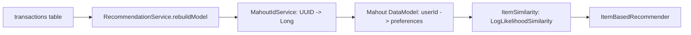
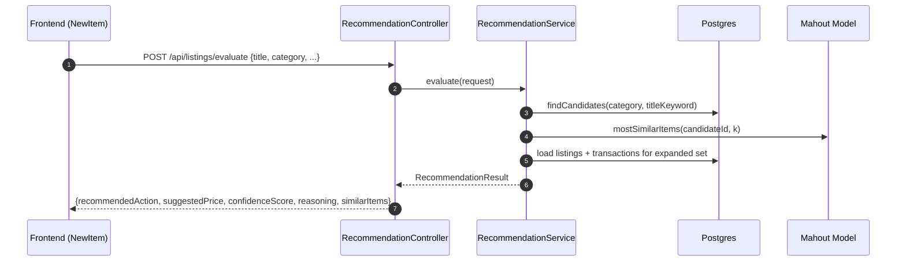

# Recommendation System (Mahout)

This document explains the recommendation feature implemented in the Vicinity24 backend and how the frontend consumes it.

## Goal

When a user is about to **give away** an item, the system suggests whether they should **lend** or **sell** it instead, and proposes a reasonable price based on historical marketplace activity.

## High-Level Architecture

The recommendation feature is implemented as a separate module under `com.vicinity24.api.recommendation`:

- Backend module root: [recommendation](file:///c:/Users/core101/Desktop/desk/shareit_back/src/main/java/com/vicinity24/api/recommendation)
- Frontend integration: [NewItem.tsx](file:///c:/Users/core101/Desktop/desk/shareit_client/share_it_client/pages/NewItem.tsx), [mockApi.ts](file:///c:/Users/core101/Desktop/desk/shareit_client/share_it_client/services/mockApi.ts)

### Components

- **RecommendationController**
  - Exposes REST endpoints used by the UI.
  - File: [RecommendationController.java](file:///c:/Users/core101/Desktop/desk/shareit_back/src/main/java/com/vicinity24/api/recommendation/controller/RecommendationController.java)
- **RecommendationService**
  - Builds a Mahout collaborative filtering model from transactions.
  - Evaluates a new item and returns a recommendation decision.
  - File: [RecommendationService.java](file:///c:/Users/core101/Desktop/desk/shareit_back/src/main/java/com/vicinity24/api/recommendation/service/RecommendationService.java)
- **MahoutIdService + MahoutIdMapping**
  - Mahout requires `long` IDs; the app uses UUIDs.
  - This layer maps UUIDs to stable sequential `Long` IDs and back.
  - Files: [MahoutIdService.java](file:///c:/Users/core101/Desktop/desk/shareit_back/src/main/java/com/vicinity24/api/recommendation/service/MahoutIdService.java), [MahoutIdMapping.java](file:///c:/Users/core101/Desktop/desk/shareit_back/src/main/java/com/vicinity24/api/recommendation/model/MahoutIdMapping.java)
- **RecommendationSeederService**
  - Seeds transactions for development if there is insufficient historical data.
  - File: [RecommendationSeederService.java](file:///c:/Users/core101/Desktop/desk/shareit_back/src/main/java/com/vicinity24/api/recommendation/service/RecommendationSeederService.java)

## Data Model (What We Learn From)

The system learns from **transactions** and links them to **listings** and **users**:

- Listing entity: [Listing.java](file:///c:/Users/core101/Desktop/desk/shareit_back/src/main/java/com/vicinity24/api/model/Listing.java)
- Transaction entity: [Transaction.java](file:///c:/Users/core101/Desktop/desk/shareit_back/src/main/java/com/vicinity24/api/model/Transaction.java)

### Mahout ID Mapping Table

Mahout operates on primitive IDs (`long userId`, `long itemId`). Vicinity24 stores IDs as UUIDs, so the module keeps a mapping table:

```
mahout_id_mapping
  - entityId    (UUID)   e.g. listing UUID or user UUID
  - entityType  (String) e.g. "USER" or "LISTING"
  - mahoutId    (Long)   stable numeric ID used by Mahout
```

Repository: [MahoutIdMappingRepository.java](file:///c:/Users/core101/Desktop/desk/shareit_back/src/main/java/com/vicinity24/api/recommendation/repository/MahoutIdMappingRepository.java)

## Data Flow

### 1) Model Build (Startup or Manual Rebuild)

The model is built from historic successful interactions: each transaction contributes a `(user, item, preference)` row.



Notes:
- The current implementation uses implicit feedback (`preference = 1.0`) for each (payer, listing) interaction.
- Similarity is computed with Mahout’s `LogLikelihoodSimilarity`, appropriate for boolean/implicit signals.

### 2) Evaluation Flow (`POST /api/listings/evaluate`)

Evaluation is a **hybrid** pipeline:

1. **Candidate retrieval (content-based)**: query listings by category + title keyword.
2. **Expansion (collaborative filtering)**: for top candidate listings, fetch “most similar items” using Mahout.
3. **Decision**: aggregate the expanded set and decide SELL vs LEND vs GIVE, plus price estimate.



## Decision Logic (How We Choose SELL/LEND/GIVE)

For the expanded candidate set:

- Count how many similar items are historically associated with:
  - `SELL` listings
  - `LEND` listings
  - other types (treated as GIVE)
- Compute:
  - **Suggested price**:
    - For SELL: average transaction amounts (fallback to listing hourlyRate if no transaction amount exists)
    - For LEND: average listing hourlyRate
  - **Confidence score**:
    - `max(countSELL, countLEND, countGIVE) / total`

Implementation: [RecommendationService.evaluate](file:///c:/Users/core101/Desktop/desk/shareit_back/src/main/java/com/vicinity24/api/recommendation/service/RecommendationService.java)

## API Contract

### Evaluate

- **Endpoint**: `POST /api/listings/evaluate`
- **Request**: `EvaluateItemRequest`
  - File: [EvaluateItemRequest.java](file:///c:/Users/core101/Desktop/desk/shareit_back/src/main/java/com/vicinity24/api/recommendation/model/EvaluateItemRequest.java)
- **Response**: `RecommendationResult`
  - File: [RecommendationResult.java](file:///c:/Users/core101/Desktop/desk/shareit_back/src/main/java/com/vicinity24/api/recommendation/model/RecommendationResult.java)

Example request:

```json
{
  "title": "Cordless drill",
  "category": "Tools",
  "description": "Works well, includes battery",
  "estimatedValue": 40
}
```

Example response:

```json
{
  "recommendedAction": "SELL",
  "suggestedPrice": 47.5,
  "confidenceScore": 1.0,
  "reasoning": "High demand for buying this type of item.",
  "similarItems": [
    { "id": "…", "title": "Drill 1", "transactionType": "SELL", "price": 50.0 }
  ]
}
```

### Admin Model Rebuild

- **Endpoint**: `POST /api/listings/admin/rebuild-model`
- **Authorization**: admin-only (method security)
- Purpose: forces a rebuild after bulk imports or data changes.

Controller: [RecommendationController.java](file:///c:/Users/core101/Desktop/desk/shareit_back/src/main/java/com/vicinity24/api/recommendation/controller/RecommendationController.java)

## Security & Access Rules

Evaluation is intended to be usable during listing creation UX. The security config explicitly permits the evaluation endpoint:

- [SecurityConfig.java](file:///c:/Users/core101/Desktop/desk/shareit_back/src/main/java/com/vicinity24/api/config/SecurityConfig.java)

## Frontend Integration

### Where it appears

The recommendation prompt is shown on the “New Item” page when:

- the user selects `ListingType.GIVE`
- the user has entered a non-trivial title + category

File: [NewItem.tsx](file:///c:/Users/core101/Desktop/desk/shareit_client/share_it_client/pages/NewItem.tsx)

### How the frontend calls the backend

The UI calls the backend via the service abstraction:

- Function: `mockApi.evaluateListingRecommendation(...)`
- File: [mockApi.ts](file:///c:/Users/core101/Desktop/desk/shareit_client/share_it_client/services/mockApi.ts)

The frontend keeps the backend call debounced to avoid sending a request on every keystroke.

## Development Notes

### Seeding

If there are too few transactions, the model will have limited coverage and will often return `"GIVE"` with low confidence.

The app includes a development seeder:

- [RecommendationSeederService.java](file:///c:/Users/core101/Desktop/desk/shareit_back/src/main/java/com/vicinity24/api/recommendation/service/RecommendationSeederService.java)

### Testing

There is an integration test that boots Spring with an in-memory H2 database and verifies the system returns a stable recommendation:

- [RecommendationServiceTest.java](file:///c:/Users/core101/Desktop/desk/shareit_back/src/test/java/com/vicinity24/api/recommendation/service/RecommendationServiceTest.java)

## Known Limitations / Next Improvements

- **Cold start**: brand-new categories or new platform instances will have low confidence until transactions accumulate.
- **Transaction typing**: current decision uses `Listing.type` as the primary SELL/LEND/GIVE signal; a more accurate approach is to persist a transaction outcome type on `Transaction`.
- **Better candidate search**: replace the title keyword heuristic with a proper search strategy (tokenization, trigram similarity, or full-text search).
- **Batch model refresh**: use scheduled rebuilds or incremental updates instead of rebuilding on-demand.

## Multi-Tenant Environment Note

This project supports static database-per-tenant routing in the backend configuration layer.

- Main env vars: `SETTING_USE_DEFAULT_DATABASE`, `TENANT_HEADER_NAME`, `TENANT_DEFAULT_ID`, `TENANT_DEFAULT_DB_URL`, `TENANT_DEFAULT_DB_USERNAME`, `TENANT_DEFAULT_DB_PASSWORD`, `TENANT_DEFAULT_DB_DRIVER`
- Optional extra tenant examples: `TENANT_A_*`, `TENANT_B_*`
- Active tenant ids are defined by the keys under `tenants.config.*` in `src/main/resources/application.properties`; the current sample configuration uses `default`, `vicinity24_tenant_a`, and `vicinity24_tenant_b`
- `SETTING_USE_DEFAULT_DATABASE=true` uses the default database only when the tenant header is missing; a valid tenant header still routes to the matching tenant database
- Startup bootstrap initializes or upgrades schema and seed data for the default database and every configured tenant database
- Full setup details live in `DOC/configuration-guide.md` and `.env.template`


